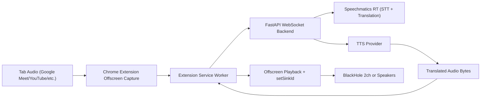
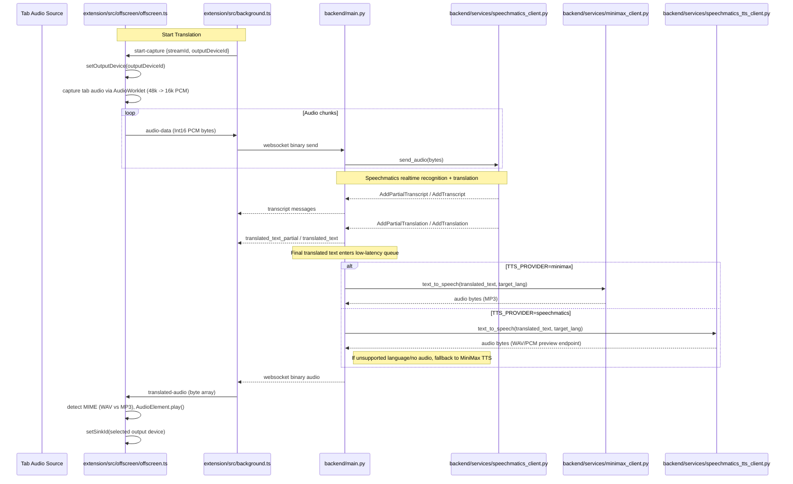

# Interpreter — Architecture

Current end-to-end data flow from tab audio capture to translated playback.

## High-Level Flow

## Detailed Sequence

## Runtime Controls (`backend/.env`)

- `USE_SPEECHMATICS_TRANSLATION=1`
  - `1`: use Speechmatics RT translation events.
  - `0`: fallback to MiniMax text translation pipeline.

- `TTS_PROVIDER=minimax|speechmatics`
  - `minimax` default, multilingual.
  - `speechmatics` preview test option (English-focused).

- `SPEECHMATICS_MAX_DELAY`
  - lower value reduces transcript finalization delay.

- `TRANSLATION_TRIGGER_CHAR_THRESHOLD`, `TRANSLATION_PARTIAL_MIN_DELTA_CHARS`, `TRANSLATION_PARTIAL_MIN_INTERVAL_MS`
  - used primarily when running MiniMax text translation mode.

## Key Files

- Extension capture/playback:
  - `/Users/xiao/interpreter/extension/src/offscreen/offscreen.ts`
  - `/Users/xiao/interpreter/extension/src/background.ts`
- Backend orchestrator:
  - `/Users/xiao/interpreter/backend/main.py`
- Provider clients:
  - `/Users/xiao/interpreter/backend/services/speechmatics_client.py`
  - `/Users/xiao/interpreter/backend/services/minimax_client.py`
  - `/Users/xiao/interpreter/backend/services/speechmatics_tts_client.py`

