# Interpreter — Text-to-Audio Pipeline

Full data-flow from microphone capture to translated audio playback.

## High-Level Overview

```mermaid
flowchart LR
    A["🎤 Tab Audio"] --> B["Chrome Extension"]
    B --> C["FastAPI Backend"]
    C --> D["Speechmatics STT"]
    C --> E["MiniMax LLM"]
    C --> F["MiniMax TTS"]
    F --> B
    B --> G["🔊 BlackHole / Speaker"]
```

## Detailed Pipeline

## Component File Map

| Layer         | File                              | Responsibility                                                       |
| ------------- | --------------------------------- | -------------------------------------------------------------------- |
| **Extension** | `background.ts`                   | Service worker — orchestrates popup ↔ offscreen ↔ backend WS         |
| **Extension** | `offscreen/offscreen.ts`          | Tab audio capture (PCM) + translated audio playback (MP3→BlackHole)  |
| **Extension** | `popup/`                          | UI — language selector, start/stop, transcript display               |
| **Backend**   | `main.py`                         | FastAPI WebSocket `/ws/translate` — routes audio through STT→LLM→TTS |
| **Backend**   | `services/speechmatics_client.py` | Speechmatics RT WebSocket — streams PCM, receives transcripts        |
| **Backend**   | `services/minimax_client.py`      | MiniMax Chat (translation) + T2A WebSocket (TTS)                     |

## Data Formats at Each Hop

